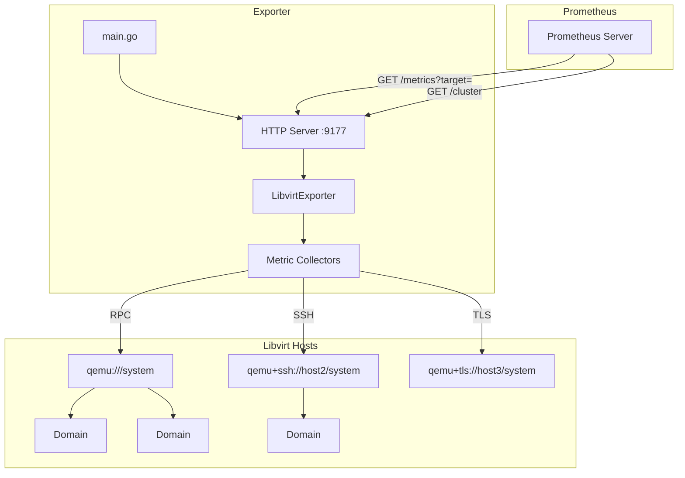
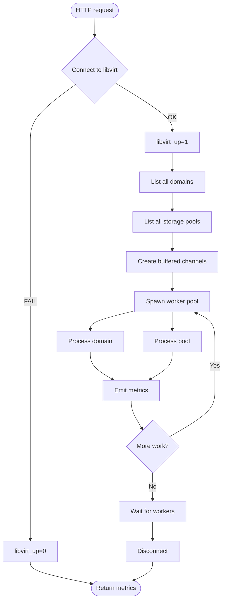
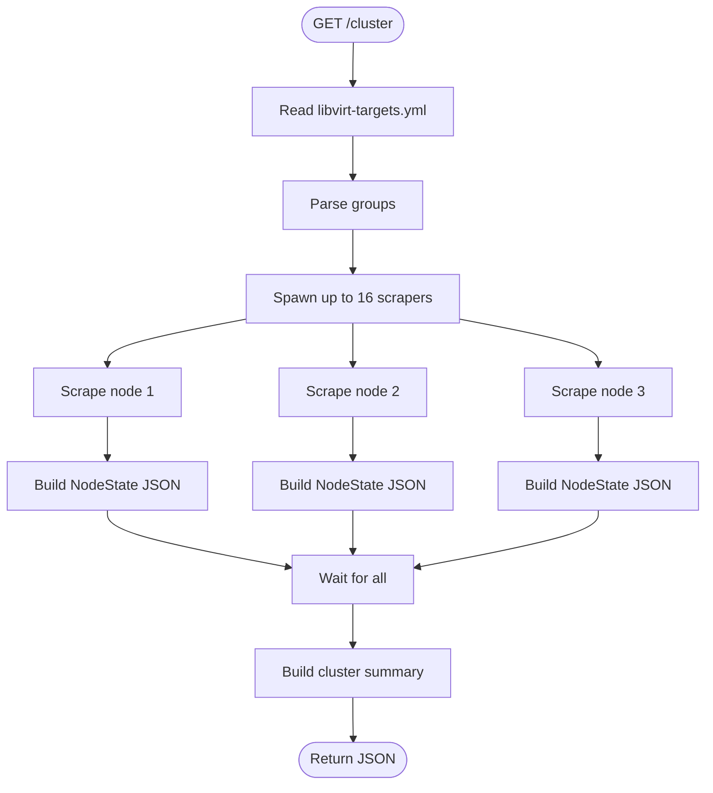

# Architecture

## Overview

The Prometheus Libvirt Exporter collects virtualization metrics from libvirt hypervisors using the pure-Go `go-libvirt` RPC client. It exposes metrics in Prometheus text format and supports both single-node and cluster-wide monitoring.



## Components

### `main.go`

Entry point responsible for:
- Parsing command-line flags
- Initializing the logger and exporter
- Registering HTTP handlers:
  - `GET /metrics` - local metrics
  - `GET /metrics?target=<URI>` - remote target metrics
  - `GET /cluster` - aggregated cluster state JSON
  - `GET /health` - health check (optional)

Key flags:
- `--libvirt.uri` - local socket path or URI
- `--libvirt.driver` - connection URI (default `qemu:///system`)
- `--exporter.timeout` - per-API-call timeout (default `3s`)
- `--exporter.max-concurrent-collects` - worker pool size (default `4`)

### `pkg/exporter/prometheus-libvirt-exporter.go`

Defines `LibvirtExporter`:

```go
type LibvirtExporter struct {
    uri                   string
    driver                libvirt.ConnectURI
    logger                *slog.Logger
    timeout               time.Duration
    maxConcurrentCollects int
}
```

Main methods:
- `Collect()` - called by Prometheus; forwards to `CollectFromLibvirt`
- `CollectFromLibvirt()` - connects, fetches domains and storage pools, dispatches workers
- `Describe()` - registers metric descriptors
- `HealthHandler()` - tests libvirt connectivity

### `cluster.go`

New handlers for multi-host monitoring:
- `clusterHandler()` - reads `libvirt-targets.yml`, scrapes all targets concurrently
- `scrapeNode()` - scrapes a single node by creating an isolated `LibvirtExporter`
- `populateNodeFromFamilies()` - parses Prometheus metric families into JSON
- `computeNodeHealth()` - derives health from `libvirt_up` and domain state metrics
- `buildClusterState()` - aggregates nodes into final JSON response

## Data Flow

### Single Target Scrape



### `/cluster` Scrape



## Metrics Collection

### Worker Pool Pattern

`CollectFromLibvirt` pushes domains and storage pools into two buffered channels and starts `maxConcurrentCollects` workers. Each worker reads from the channels and calls libvirt API functions, forwarding results to the Prometheus `ch` channel.

### Timeout Protection

Each collector spawns a goroutine and uses a `select` with `time.After(timeout)` so a hanging libvirt API call cannot block the entire scrape:

```go
ch := make(chan result, 1)
go func() {
    ch <- l.DomainGetInfo(domain)
}()

select {
case res := <-ch:
    // process res
case <-time.After(timeout):
    return fmt.Errorf("timeout"), true
}
```

### Metric Categories

**Domain info:**
- `libvirt_up`
- `libvirt_domains`
- `libvirt_domain_info_state`
- `libvirt_domain_info_maximum_memory_bytes`
- `libvirt_domain_info_memory_usage_bytes`
- `libvirt_domain_info_virtual_cpus`
- `libvirt_domain_info_cpu_time_seconds_total`

**Domain block devices:**
- `libvirt_domain_block_stats_read_bytes_total`
- `libvirt_domain_block_stats_read_requests_total`
- `libvirt_domain_block_stats_write_bytes_total`
- `libvirt_domain_block_stats_write_requests_total`
- `libvirt_domain_block_stats_capacity_bytes`

**Domain network interfaces:**
- `libvirt_domain_interface_stats_receive_bytes_total`
- `libvirt_domain_interface_stats_receive_packets_total`
- `libvirt_domain_interface_stats_transmit_bytes_total`
- `libvirt_domain_interface_stats_transmit_packets_total`

**Storage pools:**
- `libvirt_storage_pool_state`
- `libvirt_storage_pool_capacity_bytes`
- `libvirt_storage_pool_allocation_bytes`
- `libvirt_storage_pool_available_bytes`

## Connection URIs

Socket paths (`/var/run/libvirt/libvirt-sock-ro`) work only for local connections. Remote cluster nodes require QEMU connection URIs:

| URI | Use case |
|-----|----------|
| `qemu:///system` | Local system daemon |
| `qemu:///session` | Local user session |
| `qemu+ssh://user@host/system` | Remote over SSH |
| `qemu+tcp://host/system` | Remote over TCP (insecure, dev only) |
| `qemu+tls://host/system` | Remote over TLS |

## Cluster Endpoint

### Targets file

Default path: `/etc/libvirt-exporter/libvirt-targets.yml`

```yaml
- targets:
  - qemu:///system
  labels:
    datacenter: dc1
    role: local

- targets:
  - qemu+ssh://root@node1.example.com/system
  - qemu+ssh://root@node2.example.com/system
  labels:
    datacenter: dc1
    role: compute
```

### JSON response

Top-level fields:
- `generated_at`
- `scrape_duration_seconds`
- `targets_file`
- `summary` - total nodes, nodes up/down, overall health, domain counts
- `nodes` - per-node host, labels, up, health, domains, storage pools

### Health levels

- `healthy` - node reachable and no crashed domains
- `warning` - non-critical issues
- `critical` - unreachable or crashed domain detected
- `unknown` - could not determine status

Cluster `overall_health` is the worst level among all nodes.

## Concurrency & Performance

- Single scrape: `maxConcurrentCollects` domain/pool workers
- `/cluster`: up to 16 parallel node scrapers
- Remote SSH scrapes add ~1-3s per node due to SSH handshake
- Use `ControlMaster` in `~/.ssh/config` to reuse SSH connections

## References

- [Libvirt API](https://libvirt.org/html/index.html)
- [go-libvirt](https://github.com/digitalocean/go-libvirt)
- [QEMU URIs](https://libvirt.org/uri.html)
- [Prometheus Exposition Format](https://prometheus.io/docs/instrumenting/exposition_formats/)
